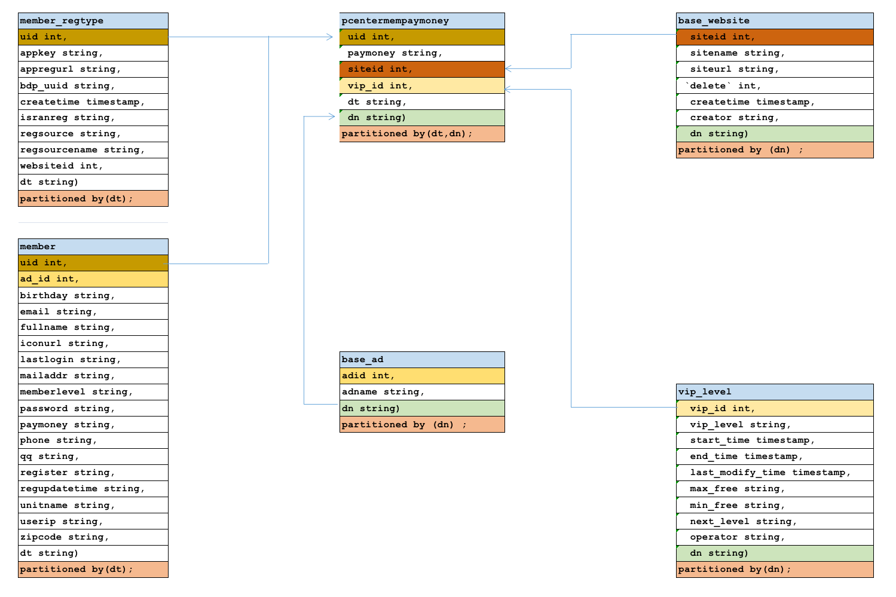

## Flink Icerberg 模拟建仓-维度建模

### Apache Iceberg

Apache Iceberg是一种用于大型分析数据集的开放表格，Iceberge向Trino和Spark添加了使用高性能格式的表，就像Sql表一样。

Iceberg为了避免出现不变要的一些意外，表结构和组织并不会实际删除，用户也不需要特意了解分区便可进行快速查询。

（1）Iceberg的表支持快速添加、删除、更新或重命名操作

（2）将分区列进行隐藏，避免用户错误的使用分区和进行极慢的查询。

（3）分区列也会随着表数据量或查询模式的变化而自动更新。

（4）表可以根据时间进行表快照，方便用户根据时间进行检查更改。

（5）提供版本回滚，方便用户纠错数据。

 

   Iceberg是为大表而建的，Iceberg用于生产中，其中单表数据量可包含10pb左右数据，甚至可以在没有分布式SQL引擎的情况下读取这些巨量数据。

（1）查询计划非常迅速，不需要分布式SQL引擎来读取数据

（2）高级过滤：可以使用分区和列来过滤查询这些数据

（3）可适用于任何云存储

（4）表的任何操作都是原子性的，用户不会看到部分或未提交的内容。

（5）使用多个并发器进行写入，并使用乐观锁重试的机制来解决兼容性问题


### 数仓的特点

（1）集成性

    数仓中存储的数据来源于多个数据源，原始数据在不同数据源中的存储方式各不相同。要整合成为最终的数据集合，需要从数据源经过一系列抽取、清洗、转换的过程。

（2）稳定性

    数仓中保存的数据是历史记录，不允许被修改。用户只能通过分析工具进行查询和分析。

（3）动态性

    数仓的数据会随时间变化而定期更新，这里的定期更新不是指修改数据，一般是将业务系统发生变化的数据定期同步到数仓，和稳定性不冲突。不可更新是针对应用而言，即用户分析处理时不更新数据

（4）主题性

    传统数据库对应的业务不同，数仓需要根据需求，将不同数据源的数据进行整合，即数据一般都围绕某一业务主题进行建模。例如“贷款”主题、“存款”主题等。

（5）扩展性

    之所以有的大型数据仓库系统架构设计复杂，是因为考虑到了未来3-5年的扩展性，这样的话，未来不用太快花钱去重建数据仓库系统，就能很稳定运行。主要体现在数据建模的合理性，数据仓库方案中多出一些中间层，使海量数据流有足够的缓冲，不至于数据量大很多，就运行不起来了。


### 数仓的数据哪里来？

（1）业务数据

    行业在处理事务过程中产生的数据。比如用户在电商网站中登录、下单、支付等过程中，需要和网站后台数据库进行增删改查交互，产生的数据就是业务数据。业务数据通常存储在MySQL、Oracle等数据库中。

（2）用户行为数据

    用户在使用产品过程中，通过埋点收集与客户端产品交互过程中产生的数据，并发往日志服务器进行保存。比如页面浏览、点击、停留、评论、点赞、收藏等。用户行为数据通常存储在日志文件中。


### 数仓的维度建模和关系型建模的区别？

```
数仓的关系型建模严格遵守三范式理论（第一范式：属性不可分割，第二范式：不能有部分函数型依赖，第三范式：不能有传递性函数依赖），数据冗余度低，但在大数据的场景下，查询效率低。

维度模型相对清晰、简洁。以数据分析作为出发点，不遵循三范式，故数据存在一定的冗余。维度模型面向业务，将业务用事实表和维度表呈现出来，表结构简单，故查询简单，查询效率较高。
```

### 模型分层

#### ODS

ODS主要完成：

（1）保持数据原貌不做任何修改，保留历史数据，储存起到备份数据作用；

（2）数据一般采用lzo、Snappy、parquet等压缩格式；

（3）创建分区表，防止后续的全表扫描，减少集群资源访问数仓的压力，一般按天存储在数仓中。

#### DWD

​        DWD层是对事实表的处理，代表的是业务的最小粒度层。任何数据的记录都可以从这一层获取，为后续的DWS和DWT层做准备。还有对日志行为进行解析，以及对业务数据采用维度模型的方式重新建模（维度退化）。

DWD主要完成：

1. 数据清洗
（1）空值去除
（2）过滤核心字段无意义的数据，比如订单表中订单 id 为 null，支付表中支付 id 为空
（3）将用户行为宽表和业务表进行数据一致性处理，清洗的手段包括Sql、mr、rdd、kettle、Python等等。

2. 脱敏
        对手机号、身份证号等敏感数据脱敏

3. 维度退化
        对业务数据传过来的表进行维度退化和降维。（商品一级二级三级、省市县、年月日）

4. 压缩，LZO，列式存储 parquet


#### DWS

​        DWS层就是关于各个主题的加工和使用，这层是宽表聚合值，是各个事实表的聚合值。这里做轻度的汇总会让以后的计算更加的高效，如：统计各个主题对象计算7天、30天、90天的行为， 应对特殊需求（例如，购买行为，统计商品复购率）会快很多不必走ODS层反复拿数据做加工。这层会把每个用户单日的行为聚合起来组成一张多列宽表，以便之后关联用户维度信息后进行，不同角度的统计分析。涉及的主题包括：访客主题、用户主题、商品主题、优惠券主题、活动主题、地区主题等。

#### DWT

​        这层涉及的主题和DWS层一样包括：访客主题、用户主题、商品主题、优惠券主题、活动主题、地区主题等。只不过DWS层的粒度是对当日用户汇总信息，而DWT层是对截止到当日、或者近7日、近30日等的汇总信息。

    以用户主题这个来举列：
    DWS层：用户主题层是记录某一个用户在某一天的汇总行为。
    DWT层：用户主题层是记录某一个用户截止在当日的汇总行为。

#### ADS

ADS层数据是专门给业务使用的数据层，这层是面向业务定制的应用数据层。

ADS主要完成：

（1）提供为数据产品使用的结果数据、指标等。

（2）提供给数据产品和数据分析使用的数据，一般会存放在 ES、MySQL等系统中供线上系统使用，也可能会存在 Hive 或者 Druid 中供数据分析和数据挖掘使用。如报表数据，或者说那种大宽表。


### 维度建模过程

维度建模一般按照以下四个步骤：
选择业务过程→声明粒度→确认维度→确认事实

#### 选择业务过程

在业务系统中，挑选我们感兴趣的业务线，比如下单业务，支付业务，退款业务，物流业务，一条业务线对应一张事实表。

#### 声明粒度

数据粒度指数据仓库的数据中保存数据的细化程度或综合程度的级别。
声明粒度意味着精确定义事实表中的一行数据表示什么，应该尽可能选择最小粒度，以此来应各种各样的需求。

#### 典型的粒度声明如下：

订单事实表中一行数据表示的是一个订单中的一个商品项；
支付事实表中一行数据表示的是一个支付记录。

#### 确定维度

维度的主要作用是描述业务是事实，主要表示的是“谁，何处，何时”等信息。
确定维度的原则是：后续需求中是否要分析相关维度的指标。


### 原始数据格式及字段含义

#### DWD层 6张基础表



```java

//member_log 用户基本信息表

member_log 用户基本信息表
{

"ad_id": "0",                 //广告id

"birthday": "1981-08-14",     //出生日期

"dt":"20190722",              //日期分区

"dn": "webA",                 //网站分区

"email": "test@126.com",

"fullname": "王69239",         //用户姓名

"iconurl": "-",

"lastlogin": "-",

"mailaddr": "-",

"memberlevel": "6",            //用户级别

"password": "123456",          //密码

"paymoney": "-",

"phone": "13711235451",        //手机号

"qq": "10000",

"register": "2016-08-15",     //注册时间

"regupdatetime": "-",

"uid": "69239",  //用户id

"unitname": "-",

"userip": "123.235.75.48",    //ip地址

"zipcode": "-"

}


member_regtype 用户跳转地址注册表
{

"appkey": "-",

"appregurl": "http:www.webA.com/product/register/index.html",  //注册时跳转地址

"bdp_uuid": "-",

"createtime": "2015-05-11",

"dt":"20190722",        //日期分区

"dn": "webA",           //网站分区

"domain": "-",

"isranreg": "-",

"regsource": "4",       //所属平台 1.PC  2.MOBILE  3.APP   4.WECHAT

"uid": "0",             //用户id

"websiteid": "0"        //对应basewebsitelog 下的siteid网站

}


base_ad_log 广告基础表原始json数据

{

"adid": "0",                  //基础广告表广告id

"adname": "注册弹窗广告0",     //广告详情名称

"dn": "webA"                  //网站分区
}


base_website_log 网站基础表原始json数据
{

"createtime": "2000-01-01",

"creator": "admin",

"delete": "0",

"dn": "webC",                  //网站分区

"siteid": "2",                 //网站id

"sitename": "114",             //网站名称

"siteurl": "www.114.com/webC"  //网站地址

}

//pcentermempaymoneylog 用户支付金额表
{

"dn":"webA",  //网站分区

"paymoney":"162.54",   //支付金额

"siteid":"1",          //网站id对应 对应basewebsitelog 下的siteid网站

"dt":"20190722",       //日期分区

"uid":"4376695",       //用户id

"vip_id":"0"           //对应pcentermemviplevellog vip_id

}

//pcentermem_vip_level_log用户vip等级基础表
{

"discountval": "-",

"dn": "webA",                  //网站分区

"end_time": "2019-01-01",      //vip结束时间

"last_modify_time": "2019-01-01",

"max_free": "-",

"min_free": "-",

"next_level": "-",

"operator": "update",

"start_time": "2015-02-07",    //vip开始时间

"vip_id": "2",  //vip id

"vip_level": "银卡"             //vip级别名称

}

```


#### DWS层 宽表和拉链表

针对dws层宽表的支付金额（paymoney）和vip等级(vip_level)这两个会变动的字段生成一张拉链表，需要一天进行一次更新


#### ADS报表层各指标统计

统计通过各注册跳转地址(appregurl)进行注册的用户数

统计各所属网站（sitename）的用户数

统计各所属平台的（regsourcename）用户数

统计通过各广告跳转（adname）的用户数

统计各用户级别（memberlevel）的用户数


统计各分区网站、用户级别下(dn、memberlevel)的top3用户
