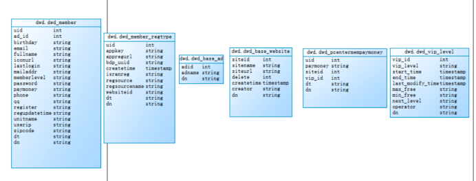
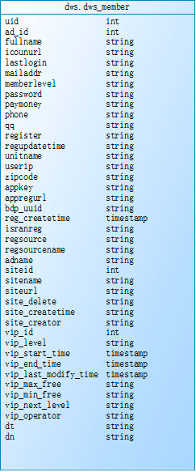

原始数据格式及字段含义

## dwd层 6张基础表


```java

//member_log 用户基本信息表

member_log 用户基本信息表
{

"ad_id": "0",  //广告id

"birthday": "1981-08-14",  //出生日期

"dt":"20190722",  //日期分区

"dn": "webA",  //网站分区

"email": "test@126.com",

"fullname": "王69239",  //用户姓名

"iconurl": "-",

"lastlogin": "-",

"mailaddr": "-",

"memberlevel": "6",  //用户级别

"password": "123456", //密码

"paymoney": "-",

"phone": "13711235451",  //手机号

"qq": "10000",

"register": "2016-08-15",    //注册时间

"regupdatetime": "-",

"uid": "69239",  //用户id

"unitname": "-",

"userip": "123.235.75.48",  //ip地址

"zipcode": "-"

}

其余字段为非统计项 直接使用默认值“-”存储即可


member_regtype 用户跳转地址注册表
{

"appkey": "-",

"appregurl": "http:www.webA.com/product/register/index.html",  //注册时跳转地址

"bdp_uuid": "-",

"createtime": "2015-05-11",

"dt":"20190722",  //日期分区

"dn": "webA",    //网站分区

"domain": "-",

"isranreg": "-",

"regsource": "4", //所属平台 1.PC  2.MOBILE  3.APP   4.WECHAT

"uid": "0", //用户id

"websiteid": "0" //对应basewebsitelog 下的siteid网站

}


base_ad_log 广告基础表原始json数据

{

"adid": "0",     //基础广告表广告id

"adname": "注册弹窗广告0",  //广告详情名称

"dn": "webA"     //网站分区

}


base_website_log 网站基础表原始json数据
{

"createtime": "2000-01-01",

"creator": "admin",

"delete": "0",

"dn": "webC",  //网站分区

"siteid": "2",  //网站id

"sitename": "114",  //网站名称

"siteurl": "www.114.com/webC"  //网站地址

}

//pcentermempaymoneylog 用户支付金额表
{

"dn":"webA",  //网站分区

"paymoney":"162.54", //支付金额

"siteid":"1",  //网站id对应 对应basewebsitelog 下的siteid网站

"dt":"20190722",  //日期分区

"uid":"4376695",  //用户id

"vip_id":"0" //对应pcentermemviplevellog vip_id

}

//pcentermemviplevellog用户vip等级基础表
{

"discountval": "-",

"dn": "webA",  //网站分区

"end_time": "2019-01-01",   //vip结束时间

"last_modify_time": "2019-01-01",

"max_free": "-",

"min_free": "-",

"next_level": "-",

"operator": "update",

"start_time": "2015-02-07",  //vip开始时间

"vip_id": "2",  //vip id

"vip_level": "银卡"  //vip级别名称

}

```


## dws层 宽表和拉链表

针对dws层宽表的支付金额（paymoney）和vip等级(vip_level)这两个会变动的字段生成一张拉链表，需要一天进行一次更新



## 报表层各指标统计
统计通过各注册跳转地址(appregurl)进行注册的用户数

统计各所属网站（sitename）的用户数

统计各所属平台的（regsourcename）用户数

统计通过各广告跳转（adname）的用户数

统计各用户级别（memberlevel）的用户数


统计各分区网站、用户级别下(dn、memberlevel)的top3用户
